# Using SchellingBoard as an attendee

Open the event link, enter the site password if asked, and pick your name from
the list. What you can do next depends on the event's phase.

| Phase          | What you can do                                                                        |
| -------------- | -------------------------------------------------------------------------------------- |
| **Proposal**   | Propose sessions, edit your own, comment on any of them                                |
| **Voting**     | All of the above, plus vote. Counts stay hidden                                        |
| **Scheduling** | Counts become visible; schedule sessions, book slots, RSVP. Proposing and voting close |

Buttons belonging to another phase are greyed out rather than hidden — hover
one to see when it opens. Organizers can skip phases, and an event with no
phase dates at all is always in the scheduling phase.

:::info "Only an RSVP commits you to anything"
Proposing a session is not a promise to give it, and voting is not a promise
to attend. [RSVPs are the exception](#rsvp).
:::

## Pick your name

By default this isn't a login — anyone can pick any name — so please pick only
your own. If you'd rather it _were_ a login, see
[Protect your name](#protect-your-name).

## Propose a session

During the **proposal** phase, click **Add Proposal** and give a title, a
description, and optionally co-hosts. You can edit your own proposals until
scheduling starts. A proposal only becomes a real session once someone puts it
on the schedule.

- **A proposal doesn't need a host.** An empty host field says "I'd like
  someone to offer this" rather than "I'll give this". Anyone who can give
  such a session takes it on by editing the proposal and adding themselves —
  nobody's permission needed.
- **Descriptions accept Markdown.** The toolbar above the box adds bold,
  italics, links, lists, quotes and code; the **Preview** tab shows how it
  will look.
- **You can browse, search and sort proposals in any phase.** Search covers
  titles, hosts and full descriptions, so a tool or prerequisite mentioned
  deep in a proposal is enough to find it. While you search, results stay
  ordered by how well they match.

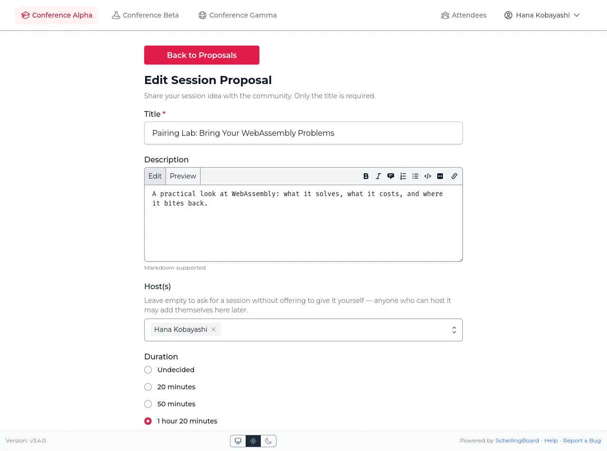

## Discuss a proposal

Open a proposal to see its comments — a good place to ask what background is
assumed, offer to co-host, or work out whether two proposals should merge.
Pick your name first, then comment or reply.

- Replies are threaded; `[-]` folds a comment and everything under it away.
- **Like** a comment to agree without adding another to the thread. Click the
  count to see who liked it, or "Liked" again to take yours back.
- You can edit or delete your own comments. Deleting is permanent — no history,
  no undo. If there are replies, a "Comment deleted" placeholder stays behind.
- Each timestamp links to that comment alone, so you can point someone at one
  particular remark.

## Vote

During the **voting** phase, react to each proposal with ❤️ Interested,
⭐ Maybe, or 👋 Skip. Click your choice again to remove it.

The fastest way is **"Go to Quick Voting!"** on the proposals page: one
proposal at a time, skipping the ones you've already voted on, counting down
how many are left.

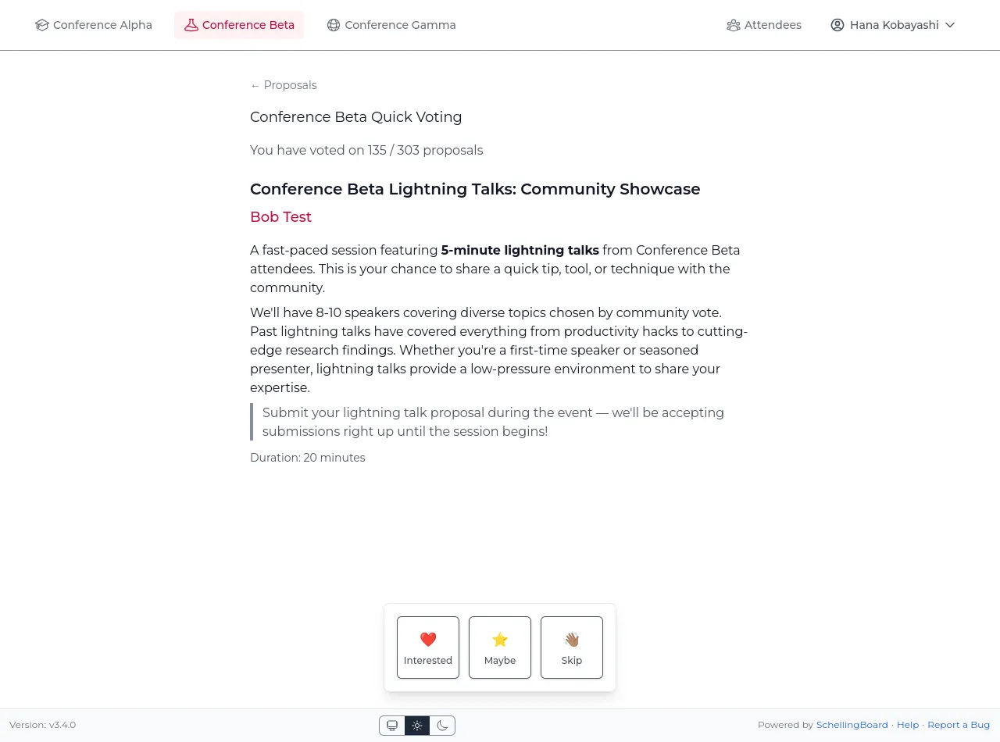

You can change your votes at any time while voting is open — your choice is
highlighted on each proposal, and the **"Only voted"** / **"Only unvoted"**
filters narrow the list to either group. You don't vote on your own proposals.

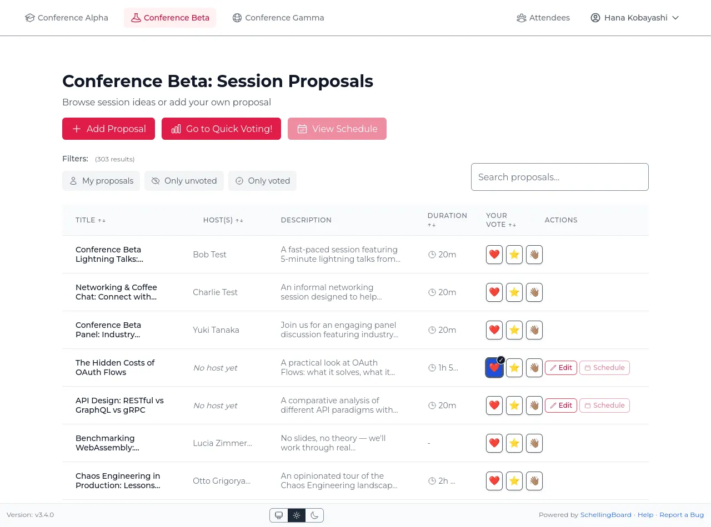

### Results stay hidden until voting closes

Nobody sees vote counts while voting runs, so early votes can't sway later
ones. The counts appear for everyone when scheduling starts.

**Only counts are ever shown — never who voted which way.** Your own votes are
visible to you alone; a host sees how many people were interested, not their
names, and neither does anyone else, organizers included.

### Why the vote buttons are greyed out

Greyed-out buttons mean voting isn't available to you _right now_. Hover one
to see why:

- **"Voting will be enabled at …"** — still the proposal phase. Add and
  discuss proposals now; come back when voting opens.
- **"Select a user first"** — you haven't picked your name yet.
- **"The voting phase is over"** — scheduling has started, and vote counts are
  visible now.

## The schedule

Once **scheduling** opens, proposals turn into real sessions on the grid.
Proposing and voting close.

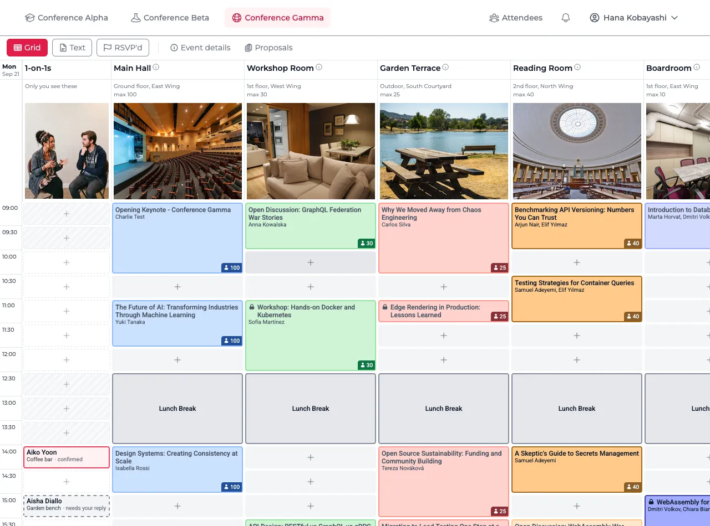

A room name with an **ⓘ** next to it has more to say — tap it (or hover it)
to read what the room offers: projector, whiteboard, the kind of seating.

While the event is running, a red line across the grid marks the current time,
and **"Now"** at the top of the schedule jumps straight to it.

On a phone, pull down from the top of the schedule and let go to load the
latest sessions.

### Put a proposal on the schedule

Two ways, whichever you find first:

- **From the proposal** — click **"Proposals"** at the top of the schedule,
  then **"Schedule"**, either in the table or on the proposal's own page. Pick
  a room and a time slot, and save.
- **From the grid** — click an empty slot in a bookable room, then use
  **"Pre-fill from proposal"** to fill the form from one of your proposals. Or
  ignore it and book the slot with a brand-new session that was never proposed.

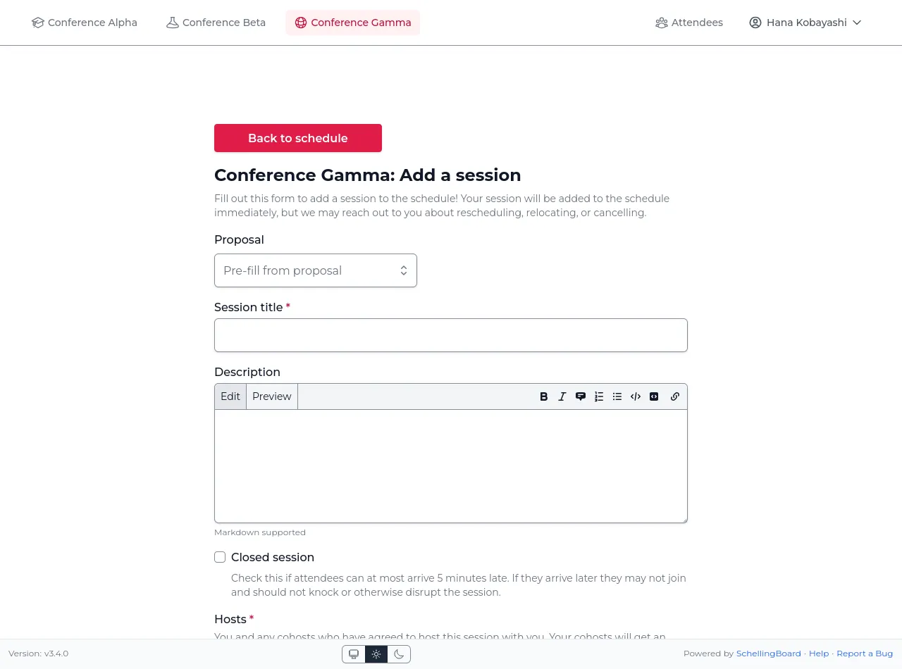

Worth knowing: **proposals with no host are up for grabs** — anyone can
schedule one, and they appear in your "Pre-fill from proposal" dropdown
alongside your own. And **the same proposal can be scheduled more than once**,
for instance twice if interest is high.

### How many people to expect

Vote counts show how much interest there is, not how many people will walk in
— voters didn't know what would end up running against your session.

Open your own proposal during scheduling to see a **vote breakdown**: how many
attendees voted and how many didn't, how the votes split across ❤️ ⭐ 👋, and
how many people to expect if you host it — a range, like "expect 8–17 people".

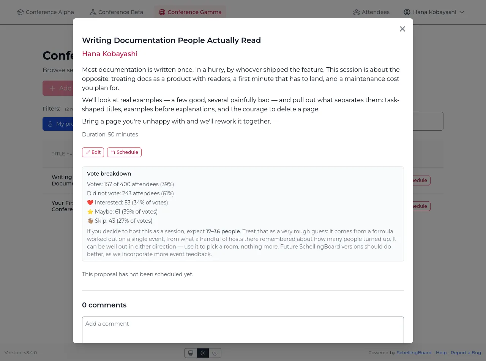

:::warning "The range is a very rough guess"
It comes from a single event where thirteen hosts recalled roughly how many
people came to their session, so it can be well out in either direction. Use
it to pick a room, nothing more. No figure is shown at all if fewer than 10%
of attendees voted on the proposal, or if nobody voted ❤️.
:::

**Keep voting ⭐ Maybe.** Today's formula happens not to use ⭐ votes, but that
rests on the same thirteen sessions — and hosts read your ⭐ as real interest
regardless.

The breakdown is for the hosts; on a proposal nobody hosts yet, anyone can see
it, since anyone may still take it on.

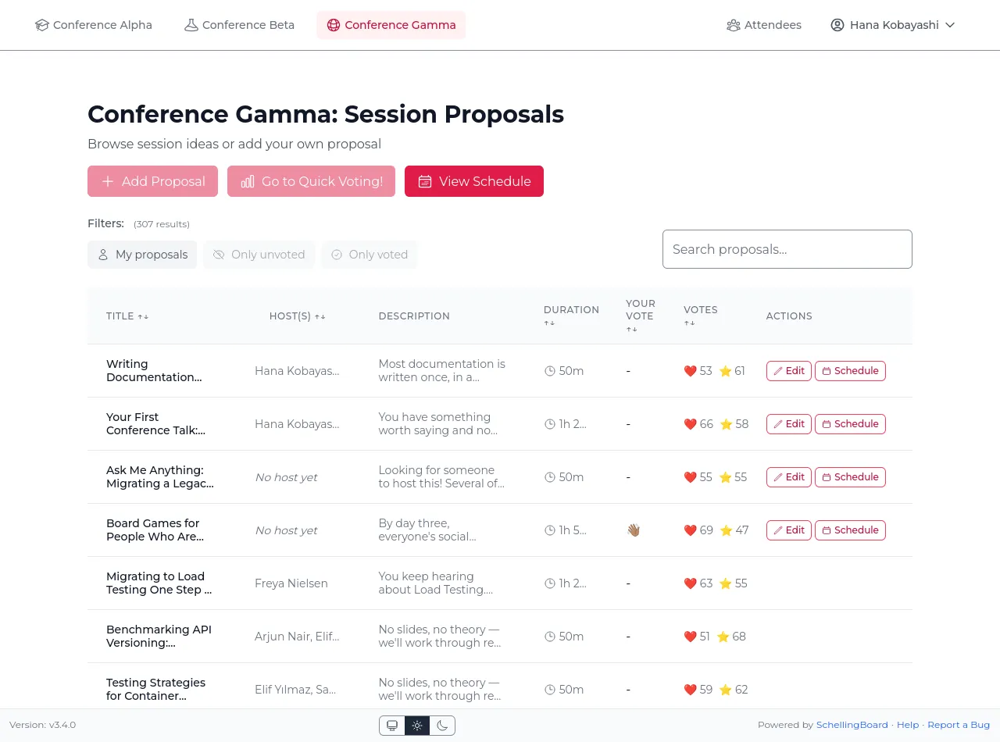

### RSVP

Click a session to see its details and **RSVP**.

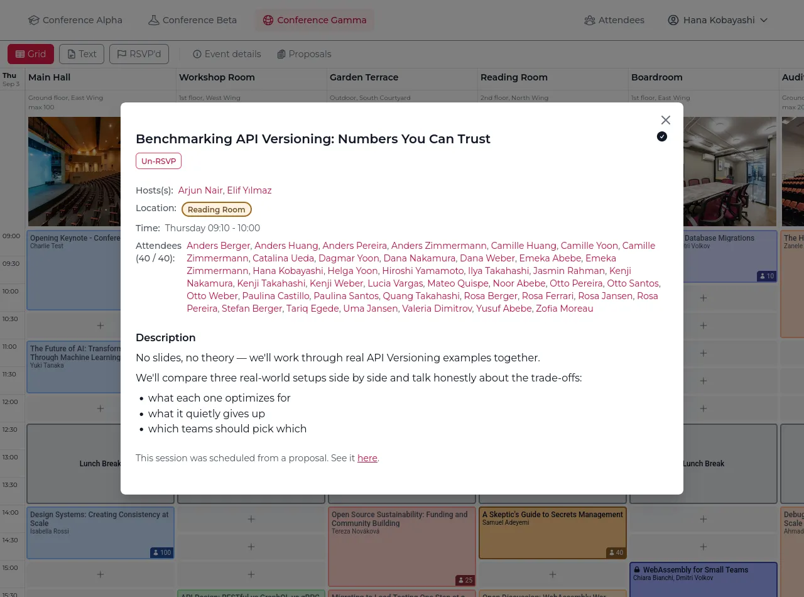

:::warning "An RSVP is a commitment"
Unlike votes, hosts plan around it. If you change your mind, take it back with
"Un-RSVP" — someone else may want the place.
:::

- You'll be warned if you RSVP to two sessions that overlap.
- Capacity is either advisory or a hard limit, depending on how the organizers
  set the event up. With a hard limit the button reads "Session full".
- A session marked **closed** warns that you can be at most five minutes late,
  but doesn't block your RSVP.

### Discuss a session

Open a session to find the same comment section proposals have — useful for
"which room did this move to?" and other last-minute coordination. Everything works as described under
[Discuss a proposal](#discuss-a-proposal): threaded replies, likes, editing and deleting your own comments.

## 1-on-1s

Under **Settings**, every event you're attending where the organizer offers
1-on-1s gets a panel of its own. That is where you say when you are free to
meet people one to one.

One switch controls the whole thing:

> **I'm open to 1-on-1s at this event**

While it is off, nobody can book you and you don't appear as bookable — it is
the opt-out, so turning it back off and saving clears what you declared.

Switching it on marks **every** slot available. Below it, each day of the event
is listed as plain checkboxes, with **Select all** and **Clear** per day; clear
the ones you want kept free and press **Save availability**.

You don't need to clear the slots where you're hosting a session or have RSVP'd
to one — anyone trying to book you is warned about those anyway. Clearing a slot
here is the firm "no"; a clash is only ever a warning. Times are shown in the
event's timezone.

Slots are as long as the event's schedule increment and cover the whole of each
day. If the organizer later changes that increment, everyone's availability is
cleared and you are asked to choose again — the slots themselves have moved.

### Ask someone for a 1-on-1

Anyone who is open to 1-on-1s has a **Schedule a 1-on-1** button on their
profile. It shows their slots day by day:

- **Available** — tap to pick it.
- **Busy** — one of you already has something at that hour: a session you are
  hosting or have RSVP'd to, or another 1-on-1. Still bookable: you get a
  warning and decide for yourselves. Your own clash is named — the session, or
  that it is another 1-on-1 — so you know what you would be missing. Theirs
  never is: you are only told they are already booked.
- **Unavailable** — a slot they cleared. That is their decision, and the one
  thing you can't book.

Then say **where to meet** — one of the organizer's suggestions, or anywhere you
type yourself. Nothing is reserved and no place is ever "full": a meeting point
is just where to find each other. You can add one line of context, and that's
the whole message — this is a request, not a chat.

The organizer sets how many requests you may have waiting for an answer at once.
Once you are at that number, wait for a reply or cancel one first.

### Answering a request

You'll get a notification (and an email, unless you've turned that off) with
who, when, where and their line of context, and **Accept** or **Decline**. It
opens on the schedule, in its slot, once the event has one.
Declining takes no explanation — nobody should feel obliged.

If the slot clashes with something of yours, the request says so before you
answer: you are the one who knows whether your own session matters more. The
person who asked was warned about the same slot, without being told what you
have on.

You can't change the time or the place — accept it or decline it, and let them
ask again if it doesn't suit. Either way they are told. A request nobody answers
before its slot begins simply lapses; nothing is held against you.

### Your 1-on-1s on the schedule

Once the event reaches its scheduling phase, your 1-on-1s get the **first
column of the schedule grid**, before the rooms: the other person's name, where
you agreed to meet, and whether it is confirmed, waiting for your reply, or
waiting for theirs. Each sits in its own time slot, next to whatever it would
clash with.

The column is yours alone — nobody else sees it, and it stays put when you
filter the schedule down to one room. It is there on every day of the event
once you take part at all — open to 1-on-1s, or with one arranged — so the
rooms line up from day to day, and it isn't there at all otherwise. It also
shows the slots you are not offering. Declined and lapsed requests drop off it.

Hovering one shows what the block has no room for — the time, their line of
context, and anything it clashes with. Tap one to open it. That is also where
either of you can **cancel** a 1-on-1 you had agreed, or take back a request
nobody has answered yet, up until the slot begins; the other person is told.

### Arrange one from the schedule

Tapping an **empty slot** in that column asks the question a profile cannot:
not "when could I meet this person" but **"who could I meet at 14:30"**. It
lists everyone who marked that slot open — with their name as a link, so you
can read their profile in another tab without losing your place — and says
where anyone is already booked, without saying what they are doing. Pick one
and the usual request form follows: where to meet, and a line of context.

The slots you did not offer to others are bookable this way too. What you
declare says who may book _you_; whom you ask, and when, is yours to decide.

## Attendee directory & profiles

The directory lists everyone at the event on a single page — photo and the
first couple of lines of their bio, or their first answered conversation
starter if they haven't written one — so you can read who is coming without
opening anything.

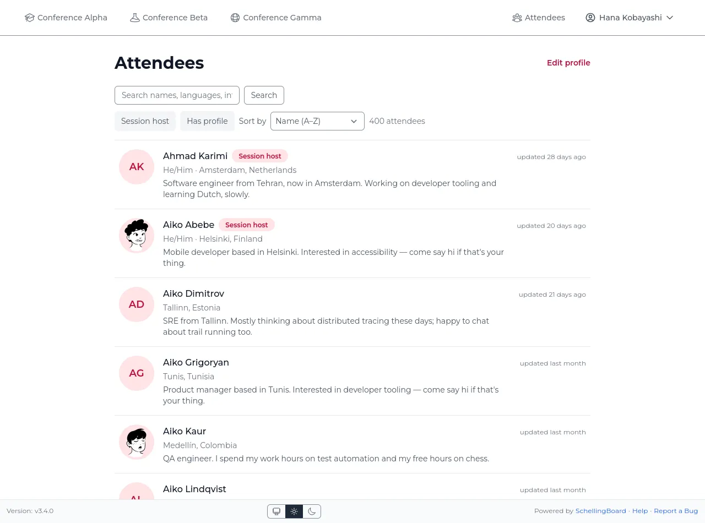

- **Filters** narrow the list to session hosts, to people who have filled in a
  profile, or to anyone **open to 1-on-1s** — anyone with slots still to come,
  at any event on the site rather than only this one.
- **Search covers everything on a profile**: names, pronouns, bios, languages,
  where someone is based, prompts and answers, and any contact details they
  published. A remembered handle, a service name like "Signal", or a shared
  interest is enough to find someone. Your private email address is never part
  of a profile and is never searched.
- **Two filters, which combine**: **Session host**, and **Has profile**
  (anyone who filled in a bio, pronouns, location, languages, photo, an
  answered conversation starter or a contact detail).
- **Sort by → Recently updated** is the quick way to see who has filled theirs
  in since you last looked. Each row shows when the profile last changed;
  empty profiles show no date and come last. While searching, results stay
  ordered by match instead, so the sort choice is unavailable.

Click any name, wherever it appears, to open that person's profile — bio,
proposals, and the sessions they're hosting. It opens _over_ the directory
rather than replacing it, so closing it puts you back exactly where you were,
search and filters intact.

- **Prev** and **Next** at the top move through attendees without going back
  to the list — so do the arrow keys, and a sideways swipe on a phone. They
  follow whatever the list is showing, so a search or filter narrows what you
  read through, and the count at the top says where you are.
- **Escape** closes the profile.
- The photo is shown large, since that's how you recognise someone; click it
  for larger still. On a wide window it stays beside you as you scroll,
  together with name, pronouns, location and languages.

A profile ends with the same comment section proposals and sessions have — a good place to say hi, find someone to share
a ride with, or ask something before the event. Everything works as described under
[Discuss a proposal](#discuss-a-proposal): threaded replies, likes, editing and deleting your own comments.

## Your profile

After picking your name, open **"Edit profile"** to set your About me,
pronouns, and avatar. These are visible to other attendees wherever your name
appears — proposals, hosting, RSVPs.

About me, conversation-starter answers, and contact details all accept
Markdown, and a web or email address you paste in becomes clickable on its own.

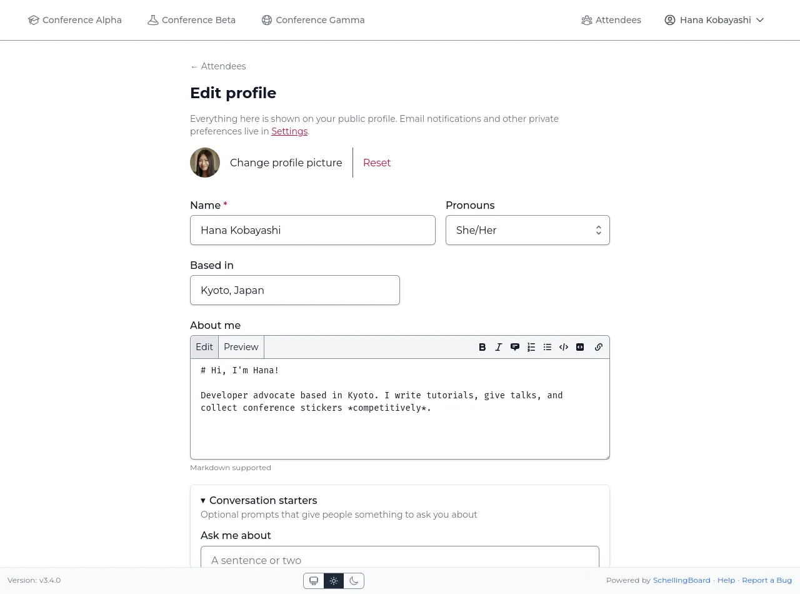

## Protect your name

Normally anyone on the site can pick your name and act as you. To require a
login instead, open **Settings → Account security** and click **Enable
protection**. You'll be emailed an 8-character code, valid for 10 minutes;
type it in to confirm. You can set a password at the same time.

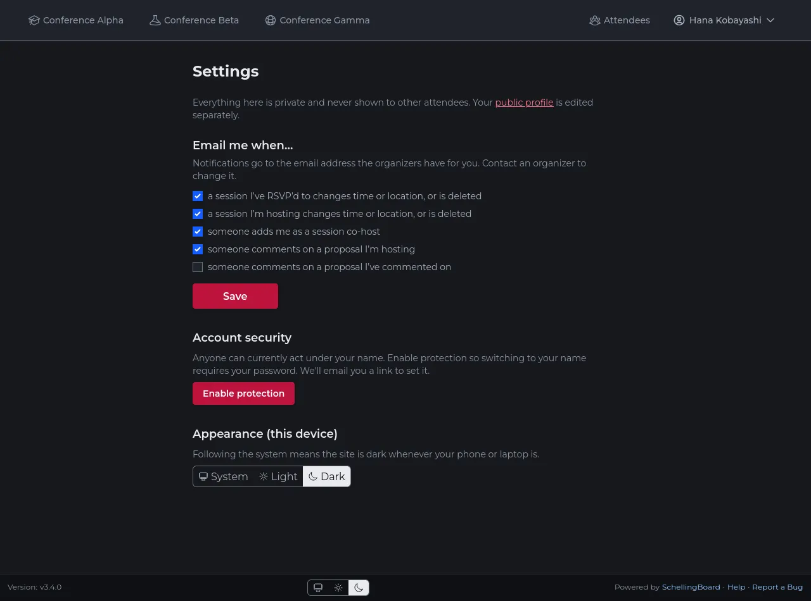

Once protected, picking your name asks for that password or a fresh emailed
code. The login lasts a week, or until you switch to a different name, and
covers everything done as you: voting, RSVPing, editing your profile, creating
or changing sessions. Turning protection off or changing the password needs
either the current password or a fresh code, and you'll get an email telling
you it happened.

- **Codes go to the email address the organizers have on file for you.** If
  you can't receive it, ask them to check the address. If the event has no
  email set up, protection isn't available.
- **Protection is what makes your sessions yours.** Only a session's hosts can
  edit or delete it — but an unprotected name can be picked by anyone, who then
  edits as you.
- **Lost both your password and your email?** Ask an organizer to update the
  address on file; codes then go to the new one.

## Install it on your phone

You can add the site to your home screen and open it like an app — its own
icon, its own window, and no address bar eating a line of the schedule.

- **iPhone or iPad**: open the site in Safari, tap the Share button, then
  **Add to Home Screen**.
- **Android**: open it in Chrome and tap **Install app** (or **Add to Home
  screen**) in the ⋮ menu.
- **Desktop**: Chrome and Edge show an install icon at the right-hand end of
  the address bar.

It is the same site either way, signed in as the same name.

## Notifications

The bell in the header counts what is waiting for you, and the notifications
page lists everything newest first. You'll be told when:

- a session you host or have RSVP'd to is moved or deleted
- someone adds you as a co-host
- someone comments on a proposal or session you host, or on your profile
- someone else comments on something you commented on
- someone asks you for a 1-on-1, or answers a request of yours

**Clicking a notification marks it read and takes you straight to what
happened.** If you'd rather clear one without opening it, use the tick beside
it. To handle a batch, tick the ones you mean — or **Select all** for
everything on the page — and then **Mark as read** or **Delete**. Deleting is
permanent: the notification is gone for good, so the page keeps only what you
choose to keep.

Notifications appear whether or not the event has email set up, and turning an
email off (below) never hides it here.

### On your phone, while the site is closed

**Settings** has a **Notifications on this device** section. Turn it on and the
same notifications reach your phone or laptop when the site isn't open.

- **Each device is separate.** Turning it on on your phone doesn't turn it on on
  your laptop.
- **A device gets all of them.** The email settings below only decide what is
  emailed; to stop the notifications on a device, turn it off there.
- **On iPhone and iPad it only works once the site is
  [on your home screen](#install-it-on-your-phone)**, opened from that icon
  rather than a Safari tab. That is Apple's rule, not ours, and the section
  says so until you're there.
- **Deleting the home screen icon turns it off**, and you'll need to turn it on
  again after adding the site back.
- **A shared phone or laptop follows whoever turned it on last.** If someone
  else picks their name on it, your notifications keep arriving there until
  they open Settings, which turns them off.

## Settings

- **Email notifications** (if the event has email) — the same list as
  Notifications above, sent to your inbox as well. All on by default, each can
  be turned off. Emails about every new comment on a proposal, session or
  profile _you_ commented on are off by default. Turning one off stops the
  email only — you still see it in the app. Every email says what happened and
  links to it — session descriptions and comment text stay on the site rather
  than going out to your email provider.
- **1-on-1s** — one panel per event you're attending that offers them, with the
  switch and the slots you're keeping free. See [1-on-1s](#1-on-1s).
- **Appearance** — System, Light or Dark, also available at the very bottom of
  every page. **System** follows your phone or laptop, so the site turns dark
  in the evening if your device does. The choice is remembered per device, not
  per name, and works before you've picked a name.
