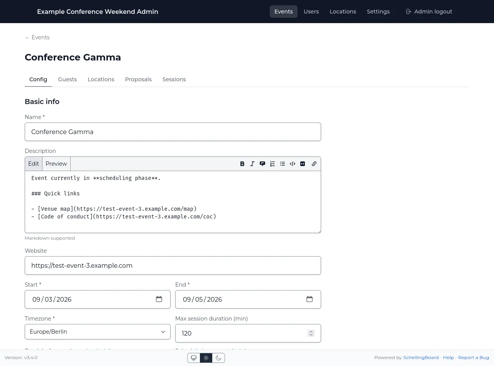

# Admin UI guide

The admin UI lives at `/admin`, gated by a single shared `ADMIN_PASSWORD` (no
per-admin accounts). It is completely independent from `SITE_PASSWORD` —
neither password grants access to the other side. Unset, `/admin` returns a
404 rather than a login prompt.

:::warning "Changing a password does not log anyone out"
Both gates sign their cookies with `AUTH_SECRET`, and existing sessions stay
valid for up to a week. To revoke access immediately, rotate `AUTH_SECRET`
too — which logs out everyone, attendees included.
:::

## Site settings

One global row shown when there's more than one event (see
[multi-event installs](how-it-works.md#multi-event-installs)):

- **Title** (required) and **Description** (Markdown) for the landing page.
- **Map image** — JPEG/PNG/WebP, max 5 MB.

## Events

- **Name** (required) — the URL slug is derived from the name once, at
  creation, and never changes afterwards even if you rename the event later.
  This keeps existing links/bookmarks working. `admin`, `api`, `login`, and
  `media` can't be used as event names.
- **Description** (Markdown), **Website**, **Start/End dates**, **Timezone**
  (required — all dates/times for this event are edited in this zone),
  **Icon** (decorative).
- **Max session duration**, **break before each session**, **schedule
  increment** (15/30/60 min grid granularity — can't be changed if it would
  misalign existing days or sessions).
- **Enforce session capacity as a hard limit** — when on, RSVPs are rejected
  once a session's capacity is reached; otherwise capacity is advisory only.
- **Phases** — the three phase date ranges, see [How it works](how-it-works.md#the-three-phases).
- **Days** — per-day schedule windows: visible Start/End time range, plus a
  separate Bookings open/close window controlling when attendees can
  self-book a blank bookable slot on that day. Deleting a day also deletes
  any sessions scheduled inside it (warned before confirming).
  A day may end after midnight (e.g. Friday 09:00 → Saturday 03:00). Since a
  session always belongs to exactly one day, that is how you allow late-night
  sessions: extend the evening's day into the small hours instead of adding a
  separate day for them. Hosts then pick that day and a time such as 01:00,
  and the session is scheduled on the following calendar date.
- **Deleting an event** requires typing the event name to confirm, and
  cascades to its days, proposals, sessions, RSVPs, and guest/location
  assignments.

## Locations

Locations are a **global pool**, not per-event — one location can be
assigned to multiple events. The event's "Locations" tab only
assigns/unassigns from this pool; it doesn't create new ones.

- **Name, Capacity, Description, Area description, Color** (schedule grid).
- **Bookable** — whether attendees can self-book blank slots here. A location
  that isn't bookable still shows on the grid and you can schedule sessions
  into it yourself; attendees just can't pick it.
- **Hidden** — excludes it from the visible grid without deleting it, and from
  everything attendees can book.
- **Image** — JPEG/PNG/WebP, max 5 MB, min 400px wide, **must be 4:3**
  (±2% tolerance).
- **Sort order** — controls column order in the grid.
- **Deleting a location** requires typing the name to confirm; the dialog
  shows how many sessions/events reference it before it cascades.

Attendees are only ever offered the locations assigned to the event they are
in, that are bookable and not hidden — everything else is refused.

## Guests / Users

Guests are also a **global pool** (Name, Email — unique, About me, Pronouns,
Avatar), independent of any event. Per-event participation is a separate
assignment on the event's "Guests" tab.

- **A guest must be assigned to an event before they can vote, RSVP, or add
  a proposal/session in it** — being in the global list isn't enough. This
  is enforced server-side.
- There are no roles — every assigned guest has identical capabilities.
- **CSV import**: header row needs `name` and `email` columns (any order,
  delimiter auto-detected: comma, semicolon, or tab). The whole file is
  rejected if any row is invalid (line numbers given). Existing users
  (matched by email) aren't recreated but are still assigned to the events
  selected in the import.
- **Send test email** — see [How it works § Email](how-it-works.md#email).
- Attendees edit their own About me/Pronouns/Avatar from a profile page once
  they've picked their name; admins don't set these.

### Attendees who protect their name

Any attendee can opt into
[name protection](how-it-works.md#attendee-identity) from their own settings.
There is no admin control over this: you can't require it, and you can't turn
it off for someone.

The one thing you _can_ do is fix a lockout. Protection is anchored to the
guest's email address, so an attendee who's lost both their password and their
mailbox is stuck until you **change their email address here** — codes then go
to the new address and they can unlock themselves. **Verify who you're talking
to first; this is effectively a password reset.**

Deleting and recreating the guest also clears protection, but discards their
votes, RSVPs, and profile — prefer changing the email.

## Proposals

Admins can **edit** a proposal's title, description, duration, and host list,
and **delete** it (confirm dialog shows how many votes/host-links will be
destroyed). There's no separate approve/reject step — proposals are visible
and votable as soon as attendees submit them.

## Sessions

Admins can create/edit/delete sessions directly, outside the normal
proposal → schedule flow.

- **Title** (required), **Description** (Markdown), **Start/End time**
  (optional — blank means "not scheduled"), **Capacity**, **Hosts**,
  **Locations**.
- **Blocker** — marks the slot as unavailable (e.g. a break), not a real
  session.
- **Closed** — an attendee-facing note that latecomers shouldn't join; it
  does _not_ restrict RSVPs.
- **Admin-managed** — checked by default for admin-created sessions; hosts
  can't edit or delete an admin-managed session themselves, only the admin
  panel can.
- Deleting a session removes its RSVPs but only unlinks (doesn't delete)
  hosts/locations. Admins can also remove a single guest's RSVP from the
  session's RSVP list.
